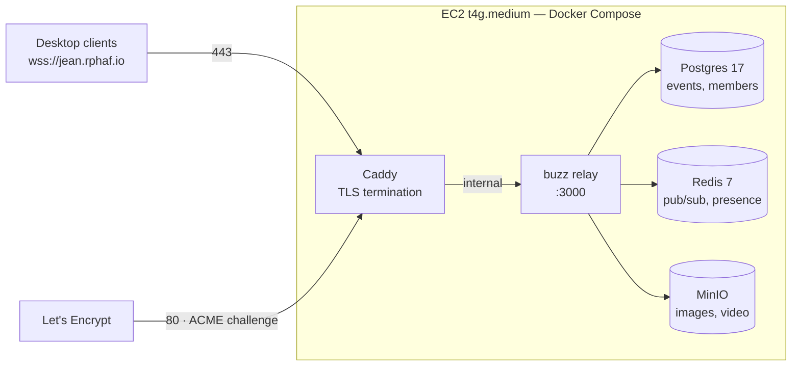

# rphaf on AWS — what we built and why

A hand-off / orientation doc for everyone with access to the AWS account. It
covers what exists, why each choice was made, what it costs, and how to operate
it.

**Status:** live. `https://jean.rphaf.io` serves a valid Let's Encrypt
certificate and the relay answers its health probe.

---

## What rphaf is

A **self-hosted team chat** server for a small group of friends. It's a fork of
[block/buzz](https://github.com/block/buzz), a Nostr-relay-based workspace.
Identity is a **Nostr keypair** — no email, no passwords, no account recovery.
Whoever holds the private key *is* that user.

The relay is **closed**: only pubkeys on the member roster can connect.

## Resource inventory (`us-east-1`)

| Resource | Value | Notes |
|---|---|---|
| **EC2 instance** | `rphaf-relay`, `t4g.medium` | ARM Graviton, 2 vCPU / 4 GB |
| **AMI** | Ubuntu 26.04 LTS (Arm64) | Login user is `ubuntu` |
| **EBS root volume** | 120 GiB `gp3`, **encrypted** (`aws/ebs`) | 3000 IOPS, 125 MiB/s |
| **Elastic IP** | `34.224.118.116` | Static — see below |
| **Security group** | `rphaf-relay-sg` | 22 ← admin IP only; 80 + 443 ← world |
| **Key pair** | `rphaf-navi` | Imported ed25519 public key |
| **VPC / subnet** | default (`172.31.0.0/16`) | Private IP `172.31.19.16` |
| **Route 53** | `rphaf.io` hosted zone | A record `jean` → the Elastic IP, TTL 300 |

## Architecture



**Only Caddy is exposed.** Postgres, Redis, and MinIO listen solely on the
internal Docker network — they have no published ports and are unreachable from
the internet. Caddy obtains and renews the TLS certificate automatically.

## Why these choices

**ARM (`t4g`) over x86 (`t3`)** — ~25% cheaper for identical specs, and every
container image in the stack publishes an `arm64` variant (verified against the
registry manifests), so nothing needed changing. *Gotcha: the AMI picker defaults
to 64-bit x86; you must switch the **Architecture** selector to **64-bit (Arm)**
or `t4g` instance types don't appear at all.*

**An Elastic IP, not the auto-assigned one** — EC2's default public IP **changes
on every stop/start**. DNS would silently point at nothing, TLS would break, and
every client would fail to connect. The EIP is free while attached, and it's what
makes resizing safe, since a resize *requires* a stop/start.

**EBS encryption at launch** — the volume holds every message, all media, and the
relay's permanent private key. You **cannot** encrypt a volume in place later;
retrofitting means snapshot → copy-with-encryption → swap. It's free, snapshots
inherit it, and the performance cost is negligible. One dropdown at launch, or an
outage later.

**4 GB rather than 8** — the whole stack idles at **~485 MB**, so 4 GB is ~3×
headroom. Resizing to `t4g.large` is stop → change instance type → start, with
the volume and Elastic IP surviving intact.

**TTL 300 on the DNS record** — deliberately short. It let us re-point the record
from an earlier DigitalOcean host to this instance in about five minutes. A
default 24-hour TTL would have made that a day-long wait.

## Cost

Approximate `us-east-1`, on-demand:

| Item | ~$/mo |
|---|---|
| `t4g.medium` | ~$24 (≈$16 with a 1-yr Savings Plan) |
| 120 GB `gp3` | ~$9.60 |
| Elastic IP | $0 while attached |
| Egress | 100 GB free, then ~$0.09/GB |
| **Total** | **~$34** before credits |

**Egress is the variable to watch.** Chat text is negligible; **media** —
images and video through MinIO — is what scales. Worth a billing alarm, which
also tells you when credits run out.

## Security posture

- **SSH:** key-only. Password auth and root login disabled. Port 22 restricted
  to the admin's IP at the security group.
- **Two firewall layers:** the AWS security group *and* `ufw` on the host, both
  allowing only 22/80/443. The security group wins if they disagree, so a rule
  missing there blocks traffic no matter what `ufw` says.
- **Encryption at rest** via EBS; **in transit** via Let's Encrypt TLS.
- **No database ports exposed** — Postgres/Redis/MinIO are internal-only.
- **`authorized_keys` is the crown jewel.** Every line in it is a passwordless
  path to root. Audit with `ssh-keygen -lf ~/.ssh/authorized_keys` and prune
  anything you can't personally account for.
- Secrets live in `/opt/rphaf/deploy/compose/.env` (mode 600), generated **on the
  box** and never committed — the repo is public.

## Operating it

All commands run from `/opt/rphaf/deploy/compose` on the instance.

```bash
ssh ubuntu@34.224.118.116

./run.sh status        # container health
./run.sh logs          # follow relay logs
./run.sh upgrade       # pull a newer image + restart
./run.sh list-members  # who can connect
./run.sh add-member <npub>            # invite someone
./run.sh add-member <npub> --role admin
```

**Never run `gen-env.sh --force`.** It regenerates every secret including
`BUZZ_RELAY_PRIVATE_KEY`, the relay's permanent identity — which orphans existing
data and makes the server look like a different machine to every client.

## Joining as a user

1. Install the rphaf desktop build.
2. Point it at `wss://jean.rphaf.io`.
3. The app generates a fresh keypair, and the relay **rejects it** — that's
   expected, since the roster is closed.
4. Send your `npub` (public key) to an admin, who runs `add-member`.
5. **Back up your `nsec` immediately** — password manager *and* somewhere
   offline. There is no recovery. Lose it and the account is gone.

## Still outstanding

- **Nightly offsite backups** (`backup.sh` → rclone → B2/S3) — the single most
  important remaining task. Everything on that volume is irreplaceable.
- **A restore drill.** A backup you haven't restored isn't a backup.
- **A billing alarm**, so credits running out arrives as an alert not a surprise.
- **Mobile.** Deferred — the Flutter app has no feature gating yet, so it would
  expose a much larger surface than the desktop build. See
  [`distribution.md`](distribution.md).

## See also

- [`../deploy/compose/PROVISIONING.md`](../deploy/compose/PROVISIONING.md) — the step-by-step runbook
- [`../deploy/compose/PLANNING.md`](../deploy/compose/PLANNING.md) — host selection and the owner-key rules
- [`distribution.md`](distribution.md) — how builds reach people, and what Apple costs
